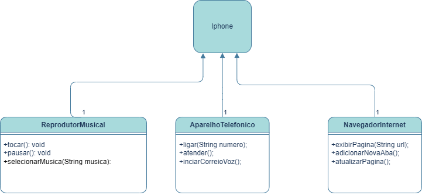

# Projeto Iphone
 - Nesse projeto fiz uma implementação bem basica para apenas demostrar o que foi proposto na UML.
## Desafio

Neste desafio, você será responsável por modelar e diagramar a representação UML do componente iPhone, abrangendo suas funcionalidades como Reprodutor Musical, Aparelho Telefônico e Navegador na Internet.

Contexto
Com base no vídeo de lançamento do iPhone de 2007 (link abaixo), você deve elaborar a diagramação das classes e interfaces utilizando uma ferramenta UML de sua preferência. Em seguida, implemente as classes e interfaces no formato de arquivos .java.

## Obejetivo

1.Criar um diagrama UML que represente as funcionalidades descritas acima.
2.Implementar as classes e interfaces correspondentes em Java (Opcional).

# Código

# DIAGRAMA UML CRIADO (DRAW.IO)

